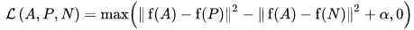
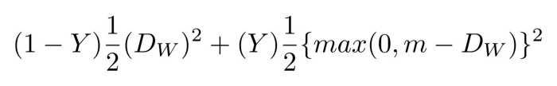

# dl-siamese-network
A Siamese Neural Network playground to train a model for face recognition on Android mobile.

## Paper
- [Deep Face Recognition: A Survey. 2020](https://arxiv.org/abs/1804.06655) [pdf](paper/1804.06655.pdf)

## Dataset
- http://www.iapr-tc11.org/mediawiki/index.php/ICDAR_2011_Signature_Verification_Competition_(SigComp2011)
```
wget http://www.iapr-tc11.org/dataset/ICDAR_SignatureVerification/SigComp2011/sigComp2011-trainingSet.zip
wget http://www.iapr-tc11.org/dataset/ICDAR_SignatureVerification/SigComp2011/sigComp2011-test.zip

```

## Setup
- For Pytorch check [official page](https://pytorch.org/get-started/locally/) 
```
pip install -r requirements.txt
```

## Loss
- Triplet Loss  :  
  During the training process, an image triplet 
  (anchor image, negative image, positive image) is fed into the model as a single sample. 
  The idea behind this is that distance between the anchor and positive images should be smaller than 
  that between the anchor and negative images
  
- Contrasive Loss
  Contrastive Loss: is a popular loss function used highly nowadays, It is a distance-based loss as opposed to 
  more conventional error-prediction losses. This loss is used to learn embeddings in 
  which two similar points have a low Euclidean distance and two dissimilar points have a large Euclidean distance.
  

## Reference Blogs
- Read about [deep face-recognition](https://machinelearningmastery.com/introduction-to-deep-learning-for-face-recognition/)
- [One-shot-learning-with-siamese-networks](https://machinelearningmastery.com/one-shot-learning-with-siamese-networks-contrastive-and-triplet-loss-for-face-recognition/)  
- https://towardsdatascience.com/a-friendly-introduction-to-siamese-networks-85ab17522942
- https://neptune.ai/blog/content-based-image-retrieval-with-siamese-networks  
- [Colab Notebook](https://colab.research.google.com/drive/1FsixLon5Zz3_rFA0xIHzc8Tvnnw8FLr8)
- [Android + DL](https://medium.com/predict/face-recognition-from-scratch-using-siamese-networks-and-tensorflow-df03e32f8cd0)
- [Oneshot Siamese Pytorch](https://towardsdatascience.com/building-a-one-shot-learning-network-with-pytorch-d1c3a5fafa4a)

## Github
- MobileFaceNets: Efficient CNNs for Accurate Real-Time Face Verification on Mobile Devices
- **Tensorflow**
  - [TF](https://github.com/sirius-ai/MobileFaceNet_TF)
  - [Android TF Lite](https://github.com/estebanuri/face_recognition)
  - [FaceNet Keras](https://machinelearningmastery.com/how-to-develop-a-face-recognition-system-using-facenet-in-keras-and-an-svm-classifier/)  
  - [Blog](https://medium.com/@estebanuri/real-time-face-recognition-with-android-tensorflow-lite-14e9c6cc53a5)
  - [2.FaceRecognition_With_FaceNet_Android](https://github.com/shubham0204/FaceRecognition_With_FaceNet_Android) [Blog](https://towardsdatascience.com/using-facenet-for-on-device-face-recognition-with-android-f84e36e19761)
  
- **PyTorch**
  - [Paper](https://arxiv.org/abs/1804.07573)
  - [Official Git](https://github.com/foamliu/MobileFaceNet)